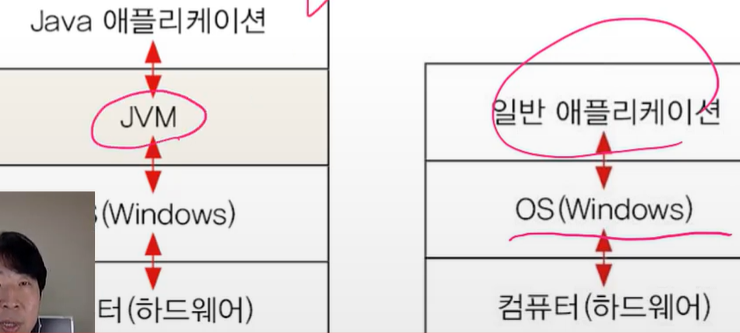

# 자바란?

> 프로그래밍 언어
>
> 실행환경(JRE) + 개발도구(JDK) + 라이브러리(API)

모던 프로그래밍 언어(객체지향 + 함수형)

## 특징

- 객체지향 언어 = 프로그래밍 언어 + 객체지향 개념(C++, Java, Python, Js...)
- 자동 메모리 관리 (가비지 컬렉터 GC)
- 멀티 쓰레드 지원
- 풍부한 라이브러리로 쉽게 개발 가능
- 운영체제에 독립적

### 자바 가상 머신(JVM) - 운영체제에 독립

- 자바 프로그램이 실행되는 가상 컴퓨터(VM)
- 한번 작성하면, 어디서든 실행

### JRE(Java Runtime Environment)

- 자바 실행에 필요한 라이브러리 파일 등
- JRE = JVS + 자바 프로그램
- JVM의 실행환경을 구성

### 

### JDK(Java Development Kit)

- 자바 개발 도구의 약자
- 컴파일러, 디버그 도구 등이 포함
- JDK = JRE + 개발을 위한 도구

### 빌드(build)

- 소스 코드 파일을 컴퓨터에서 실행할 수 있는 독립 SW 가공물로 변환하는 과정
- 독립 SW 가공물 = Artifact

1) 소스 코드를 컴파일 한다
2) 테스트 코드를 컴파일 한다
3) 테스트 코드를 실행한다
4) 테스트 코드 리포트를 작성한다
5) 기타 추가 설정한 작업들을 진행
6) 패키징을 수행
7) 최종 Artifact를 만들어낸다.

### 빌드 툴(buile tool)

- 소스코드의 빌드 과정을 자동으로 처리 해주는 프로그램
- 외부 소스 코드(외부 라이브러리) 자동 추가, 관리

- Ant, Gradle , Maven